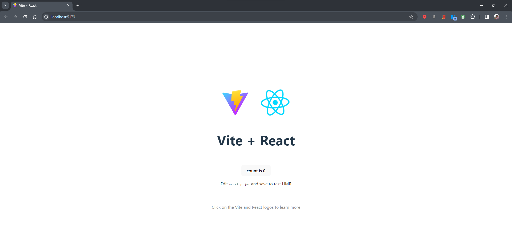

# First time React App with vite bundler

below cmd's enter in cmd or terminal in vs code.
In command prompt or terminal

>npm create vite@latest
npm install
npm run dev
```terminal

PS C:\Users\siddu\OneDrive\Desktop\Tech WorkSpace\Frontend-Development\React JS\PRACTICE> npm create vite@latest
Need to install the following packages:
create-vite@5.2.1
Ok to proceed? (y) y
√ Project name: ... ManualCounter
√ Package name: ... com.manualcounter
√ Select a framework: » React
√ Select a variant: » JavaScript

Scaffolding project in C:\Users\siddu\OneDrive\Desktop\Tech WorkSpace\Frontend-Development\React JS\PRACTICE\ManualCounter...

Done. Now run:

  cd ManualCounter
  npm install
  npm run dev

PS C:\Users\siddu\OneDrive\Desktop\Tech WorkSpace\Frontend-Development\React JS\PRACTICE> cd .\ManualCounter\
PS C:\Users\siddu\OneDrive\Desktop\Tech WorkSpace\Frontend-Development\React JS\PRACTICE\ManualCounter> npm install

added 273 packages, and audited 274 packages in 50s

98 packages are looking for funding
  run `npm fund` for details

found 0 vulnerabilities
PS C:\Users\siddu\OneDrive\Desktop\Tech WorkSpace\Frontend-Development\React JS\PRACTICE\ManualCounter> npm run dev

> com.manualcounter@0.0.0 dev
> vite


  VITE v5.1.4  ready in 499 ms


  ➜  Local:   http://localhost:5173/
  ➜  Network: use --host to expose
  ➜  press h + enter to show help


```
hold control key on keyboard and click on the above url (Local:   http://localhost:5173/) \n
output you can see in the browser as react app runs...
