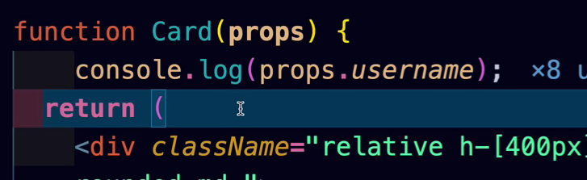
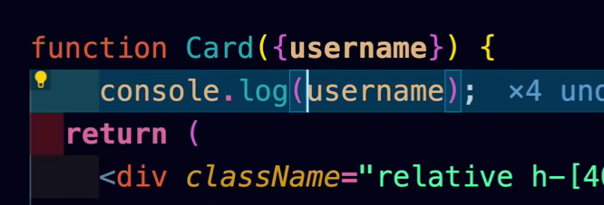
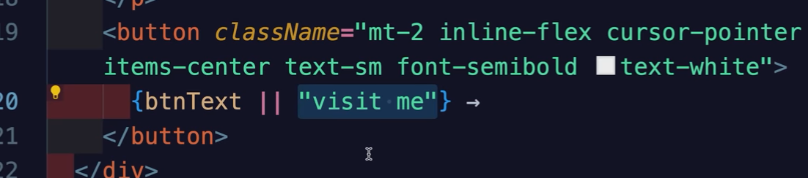
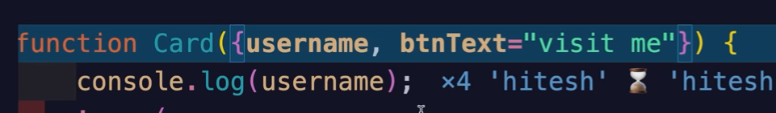
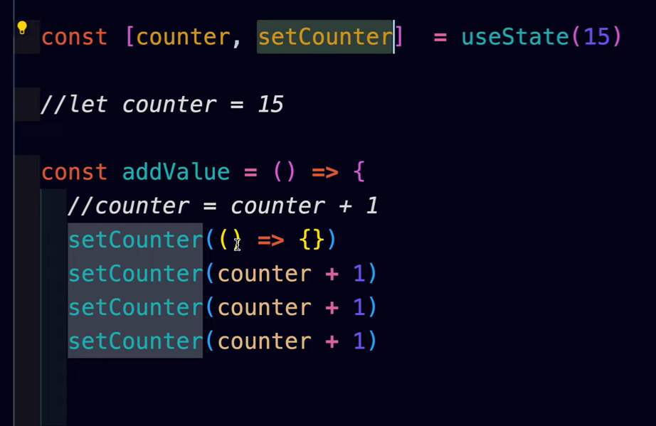
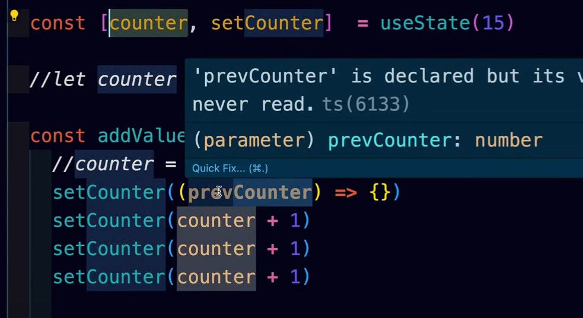
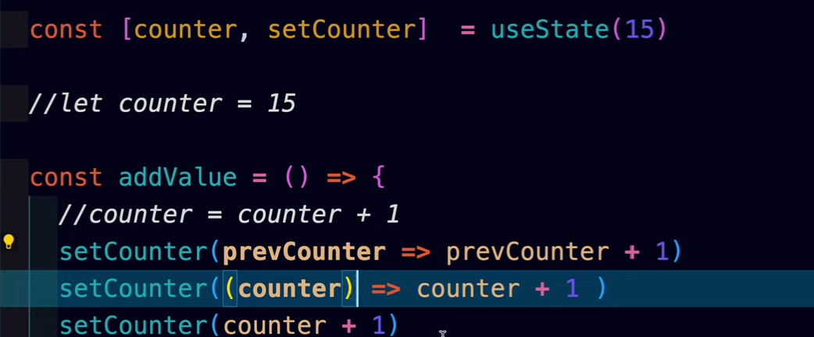

# React-JS learned from "Chai aur Code@youtube" by HitechChoudary.
- hooks = useState
- props

---
# 7 tailwindcss and props
- props

destructuring

-----
Default value setting, 
below code has readability issue, not the performance issue 

setting default value

----

Alt name for Default

----
# 8 A react interview Question

behind the scene diff alogrithms works and it takes as the batches. that is the reason it won't gets updates
so use the callback method.

----
# 9 

