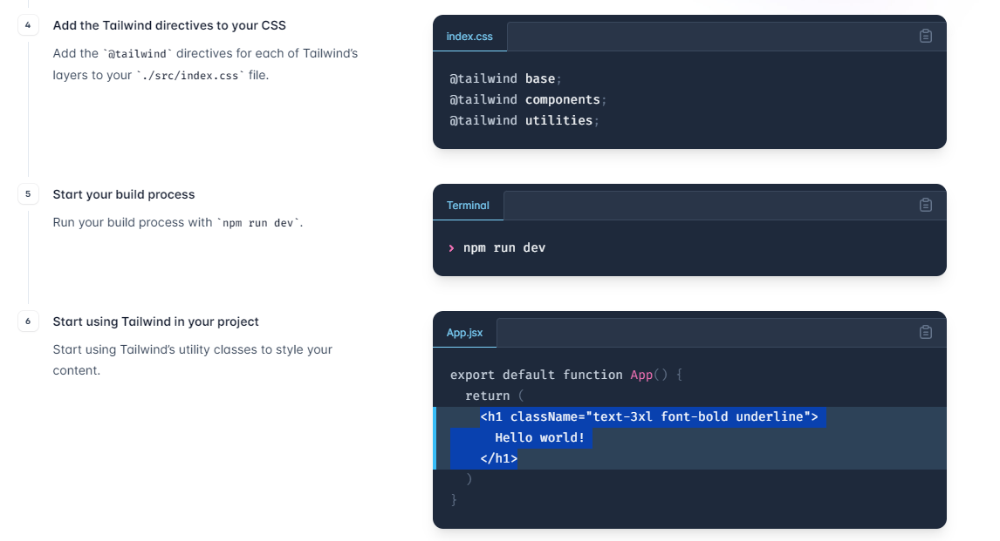
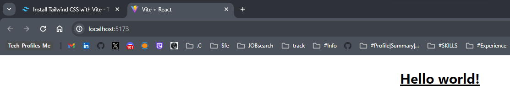

# React + Vite

This template provides a minimal setup to get React working in Vite with HMR and some ESLint rules.

Currently, two official plugins are available:

- [@vitejs/plugin-react](https://github.com/vitejs/vite-plugin-react/blob/main/packages/plugin-react/README.md) uses [Babel](https://babeljs.io/) for Fast Refresh
- [@vitejs/plugin-react-swc](https://github.com/vitejs/vite-plugin-react-swc) uses [SWC](https://swc.rs/) for Fast Refresh

# SetUp
>
npm create vite@latest<br/>
change to project directory <br/>
npm i <br/>
npm install -D tailwindcss postcss autoprefixer <br/>
npx tailwindcss init -p<br/>

navigate to tailwind.config.js file and update the content: [] as below
```
 content: [
    "./index.html",
    "./src/**/*.{js,ts,jsx,tsx}",
  ],
  ```


output : 



